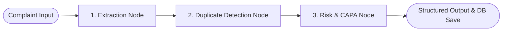

# AI Usage & LLM Orchestration Documentation

## Overview

This project was developed for the **AIVOA AI Product Engineer (Intern) Round 1 Assignment**. In accordance with the assignment guidelines, modern AI coding assistants (Google Gemini 3.6 Flash / Gemini 2.5 Pro) were leveraged to architect, code, and test the entire solution.

---

## LLM & AI Framework Stack

| Component | Framework / Model | Role in Application |
| :--- | :--- | :--- |
| **Agentic AI Orchestration** | **LangGraph** | Multi-node state graph controlling complaint processing workflow. |
| **LLM Provider** | **Groq API** | Ultra-fast inference engine for JSON extractions & Copilot chat. |
| **Primary LLM** | `gemma2-9b-it` | High-efficiency instruction-tuned model for entity extraction & JSON parsing. |
| **Secondary LLM** | `llama-3.3-70b-versatile` | Complex reasoning for ICH Q9 risk classification & RCA root cause analysis. |
| **Fallback Engine** | QMS Rules Engine | Built-in fallback ensuring zero-downtime execution when `GROQ_API_KEY` is not provided. |

---

## LangGraph Multi-Node AI Architecture

The AI engine uses **LangGraph** (`backend/app/ai/graph.py`) to execute a deterministic 3-node state workflow:

### Node Descriptions

1. **Extraction Node (`extract_complaint_node`)**:
   - Analyzes raw unstructured text (emails, phone transcripts, PDF excerpts).
   - Extracts structured fields: Reporter, Product Name, API vs FDF classification, Batch Number, Mfg/Exp Dates, Complaint Type, Severity.
   - Calculates **Complaint Completeness Score** ($0.0 - 100.0\%$) and outputs missing regulatory fields.

2. **Duplicate Detection Node (`detect_duplicates_node`)**:
   - Cross-references incoming complaint data against existing database records.
   - Matches product name, batch/lot number, and defect category.
   - Flags status as `Yes`, `No`, or `Potential Duplicate` with match details.

3. **Risk & CAPA Node (`risk_and_capa_node`)**:
   - Assesses health hazards following FDA 21 CFR Part 211 / ICH Q9 risk assessment guidelines:
     - **Class I**: Critical / Life Threatening (e.g. raw material impurity above safety thresholds).
     - **Class II**: Medium / Temporary Hazard (e.g. unsealed blister pockets causing humidity exposure).
     - **Class III**: Minor Defect.
   - Predicts probable root cause (5-Whys alignment).
   - Generates assigned **Corrective Actions** and **Preventive Actions** (CAPA) with target departments (QA, Production, Packaging, Supply Chain).

---

## AI Copilot QMS Chat Assistant

The system includes an interactive QMS Copilot drawer (`backend/app/routers/ai_router.py: /api/ai/copilot-chat`):
- Provides real-time guidance on Quality Assurance procedures.
- Assists QA managers in drafting Root Cause Analysis (5-Whys & Fishbone diagrams).
- Generates investigation protocols and audit log statements.

---

## AI Prompt Engineering Principles

All system prompts ([`backend/app/ai/prompts.py`](file:///home/silent-sovereign/Internship/AIVOA/backend/app/ai/prompts.py)) enforce strict JSON schemas using Groq's `response_format={"type": "json_object"}` mode:
- **System Role Definition**: Explicitly frames the AI as a Lead Regulatory & QMS Auditor.
- **Domain Guardrails**: Enforces ICH Q9 & FDA QMS terminology (API vs FDF, BMR logs, retain sample testing, Class I/II/III hazard levels).
- **Graceful Fallbacks**: Ensures field extraction defaults to safe fallbacks if data is missing.
